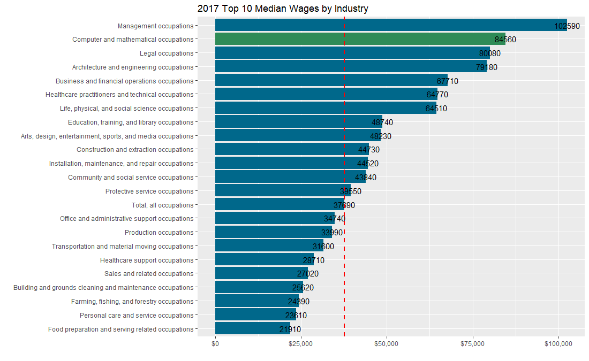

```{r setup, include=FALSE, echo=FALSE}
knitr::opts_chunk$set(echo=TRUE, error=FALSE)

# install.packages("tidyverse") 
# install.packages("scales")
# install.packages("stringr")
# install.packages("Hmisc") 
# install.packages("forcats") 
# install.packages("ggthemes") 

library("tidyverse") # contains many packages that allow you to organize, summarize, and plot data.
library("scales") # use to customize the scales of our axes.
library("stringr") # allows for manipulating of string and labels.
library("Hmisc") # provides mathematical and statistical functions to use with plots.
library("forcats") # provides tools for manipulating categorical variables.
library("ggthemes") # provides multiple themes with combinations of parameters to change a plots look and feel
library("readxl")
```
# City
<br>
<center></center><br>
<center><a href="https://www.flickr.com/photos/37527185@N05/13934368189/">PHOTO BY TYLER MERBLER</a>
<br>
Los Angeles, CA has a population of **3.98M** people with a median age of 35.6 and a median household income of $54,432. Between 2015 and 2016 the population of Los Angeles, CA grew from 3.97M to 3.98M, a 0.11% increase and its median household income grew from $52,024 to $54,432, a 4.63% increase.

# County
<br>
<center></center><br>
<center><a href="https://www.flickr.com/photos/abukij/18012989253/">PHOTO BY PAOLO GAMBA</a> 
<br>
Los Angeles County, CA has a population of **10.1M people** with a median age of 36.3 and a median household income of $61,338. Between 2015 and 2016 the population of Los Angeles County, CA declined from 10.2M to 10.1M, a 0.32% decrease and its median household income grew from $59,134 to $61,338, a 3.73% increase.
<br>
LA is a tech hub, with $ x ,000 tech jobs roughhty x% of the nation .... COmpanies like Amazon, Tesla, etc ...have headquarters in Los Angeles. It is a vibrant segment of the economy. While California is the 7th economy in the world, Los Angeles is the 24th economy in the world bigger than countries like ....
<br>
Let's take a look at the tech industry employment [1] numbers for the past 13 years.
<br>

# Wages and Prospect

```{r Bureau Labor Statistics, include=FALSE, message=FALSE, echo=FALSE, warning=FALSE}

# load data
occupation <- read_excel("./data/occupation.xlsx", sheet = "Table 1.1", skip = 2)
occupation <- occupation[1:23,] ### Removes Annotaions - keeps all data
colnames(occupation) <- c("industry","code", "2016", "2026", "change2026", "perchange206","median_wages17")

# rename industries
occupation$industry <- c("Total All Occupations","Management","Business & Financial Operations",
                         "Computer & Mathematical","Architecture & Engineering",
                          "Life, Physical, & Social Science","Community & Social Service","Legal",
                         "Education, Training & Library","Arts & Recreation",
                          "Health Practitioners & Technicians","Healthcare Support","Protective Service",
                         "Food & Serving","Cleaning & Maintenance",
                          "Personal Care & Service","Sales","Administrative",
                         "Farming, Fishing, & Forestry","Construction & Extraction",
                          "Installation, Maintenance, & Repair","Production","Transportation & Material Moving")
                         
# Fix Labels
occupation$industry <- as.factor(occupation$industry)
levels(occupation$industry)

# Reordering Bars by Mean

# It is often useful for visual communication if the bars are ordered by height (mean). This allows the reader to 
# determine at a glance which industries earn the highest and lowest wages and where a particular industry falls
# in the distribution.
levels(occupation$industry)

occupation$industry <- fct_reorder(occupation$industry, occupation$median_wages17, mean, na.rm=TRUE)

occupation$compu <- (occupation$industry == "Computer & Mathematical")
```


```{r Median Wages by Industry in 2017}
# add geom_hline showing "Total media wages"
# # Change the "horizontal justification" to be left-justified with hjust 

mycols <- c("blue", "red")
ggplot(data=occupation, mapping=aes(x=industry, y=median_wages17, fill=compu)) +
  stat_summary(fun.y=mean, geom="bar") +
  scale_y_continuous(labels=dollar) +
  labs(title="Median Wages by Industry in 2017", x="", y="") + 
  coord_flip() + 
  theme(legend.position="none") + 
  scale_fill_manual(values=mycols) + 
  geom_text(aes(label = median_wages17), color = "black", hjust=-0.1) +
  geom_hline(yintercept = 37690, color="red", size=1, linetype="dashed")
```


```{r Number of jobs change projected for 2026}
# remove all occupations

occupation <- occupation[2:23,]

occupation$industry <- fct_reorder(occupation$industry, occupation$change2026, mean, na.rm=TRUE)
ggplot(data=occupation, mapping=aes(x=industry, y=change2026, fill=compu)) +
  stat_summary(fun.y=mean, geom="bar") +
  scale_y_continuous() +
  labs(title="2016-2026 Employment Jobs Growth Projection by Industry", x="", y="") + 
  coord_flip() + 
  theme(legend.position="none") + 
  scale_fill_manual(values=mycols) + 
  geom_text(aes(label = change2026), color = "black", hjust=-0.1) 
  # geom_hline(yintercept = 37690, color="red", size=1, linetype="dashed")
```
```{r Percentage Growth Change 2026}
occupation$industry <- fct_reorder(occupation$industry, occupation$perchange206, mean, na.rm=TRUE)

ggplot(data=occupation, mapping=aes(x=industry, y=perchange206, fill=compu)) +
  stat_summary(fun.y=mean, geom="bar") +
  scale_y_continuous() +
  labs(title="2016-2026 Employment Percenatage Growth Projection by Industry", x="", y="") + 
  coord_flip() +
  theme(legend.position="none") +
  scale_fill_manual(values=mycols) +
  geom_text(aes(label = perchange206), color = "black", hjust=-0.1)
```


<center></center><br>

2017 Employment by major occupational group, 2016 and projected 2026 (Numbers in thousands) [1]. 
Tech employees are compensated nicely due to this tech boom. For example, in 207 while the annual medialn wage for all occupations was $37,000 in the U.S., it was $84,600 for the computer occupations, second only to $102,000 of the management occupations as shown in Table 1.
<br>
<center></center><br>


# Total Jobs & Grownth from 2012 to 2017 - Dinamic Visualization

<center>**GoogleVis Motion Chart** </center><br>

<center></center><br>

Figure 1 shows the total jobs in the city of Los Angeles and County.

<center></center><br>

Figure 2 shows the grownth of all jobs in the city of Los Angeles and County. 

<center></center><br>

Figure 3 shows the total tech jobs in the city of Los Angeles and County.

<center></center><br>

Figure 4 represents the year over year grownth of Tech jobs in the city of Los Angeles anc County.

# Density of Tech Jobs by zip code from 2012 to 2017 - Dinamic Visualization

<center></center><br>


California is the center of high-tech and innovation in the world.  [18].

# Interactive Map

<center></center><br>

# Correlation Between the CHCI and the Median House Income of Los Angeles County Zip Codes
<br>
Fig. 8 shows the association between the 2012 CHCI and the 2016 median household income of 282 zip codes in L.A. County. We can see a **very strong correlation** correlation between the human capital level [23] and the household income for the zip code in L.A. It demonstrates the importance to invest in education (chci) in order to create more productive workforce and more high paying jobs.

```{r fig8, include=TRUE, message=FALSE, echo=FALSE, warning=FALSE}
knitr::opts_chunk$set( fig.height = 3.5, split=FALSE, fig.align = 'center')
library(readxl)
library(tidycensus)
library(tidyverse)
chci <- data.frame(read_excel("./data/lacounty_zip_chci.xlsx", sheet="2012"))
# Getting data from the 2012-2016 5-year ACS
income <- get_acs(geography = "zcta", 
                  variables = c(medincome = "B19013_001"))
cor <- merge(chci, income, by.x = "zip", by.y = "GEOID")
# Create the scatter plot with regression line
p7 <- ggplot(cor, aes(x=chci, y=estimate)) +
  geom_point(colour = "blue", size=4) + 
  labs(title = "Fig. 8 ",
       x = "City Human Capital Index", y = "Median Household Income") +
  scale_x_continuous(limits = c(85, 175)) +
    geom_smooth(colour = "red", method=lm,   # Add linear regression line
              se=FALSE)    # Don't add shaded confidence region
p7
```

Source - 5-year American Community Survey 2012-2016 Global Innovation Index 2018, World Bank Population Data 2016, Q11 - Current country of residence [19-21]


# Conclusions

* Gender imbalance continues (Fig. 1)
* BRICS to outnumber Western countries by 2020 (Fig. 6)
* User prevalence moderatedly-correlated with innovation (Fig. 8)


# References


1. [1] **Assumptions** Tech industry employment was calculated using the following: (1) Information jobs (NAICS: 51), and (2) Professional, Scientific, & Technical Skills (NAICS: 54). Data source: Quarterly Census of Employment and Wages (QCEW) developed through a cooperative program between the states and the U.S. Bureau of Labor Statistics.-- These data are summarized by Industry Sector (2-digit NAICS).
2. [2] https://www.bls.gov/emp/tables/emp-by-major-occupational-group.htm

Shape Files - https://data.lacity.org/ Los Angeles Open Data
ACS
 

23. [23] http://www.anderson.ucla.edu/centers/ucla-anderson-forecast/projects-and-partnerships/city-human-capital-index


# Acknowledgements
- This project was largely inspired by conversations with Dr. William Yu, UCLA 
- Dynamic Visualizations were inspire by <a href="https://www.google.com/publicdata/directory">Google Public Data Explorer</a>.
- Fig. 3 and 5 was largely inspired by conversations with Ferran Pujol of McKinsey &Co. Chile. 
- Fig. 6 inspired by the charts of @ash316 [15]
- Fig. 1,2,3 inspired by the charts of @paultimothymooney [4]
- <a href="https://twitter.com/hadleywickham">Hadley Wickham</a>, for his development of <a href="https://en.wikipedia.org/wiki/Hadley_Wickham">ggplot2
</a> (Fig 7, 8), the open-source statistical analysis & data visualisation based on Leland Wilkinson's book Grammar of Graphics. 


<a href="https://www.theverge.com/2018/11/2/18057716/google-walkout-20-thousand-employees-ceo-sundar-pichai-meeting">#googleWalkout</a> [2] and is bad business - says Forbes [3]. In Fig. 1 (above), we use superhero-themes #batman #wonderwoman to visualize the heavy topic of #gender_equality in #datascience. See a bar chart for a more accurate breakdown [4]. Source: survey question Q1 - What is your gender? Sample size =  23,859 respondents 


2. [2] https://www.theverge.com/2018/11/2/18057716/google-walkout-20-thousand-employees-ceo-sundar-pichai-meeting
3. [3] https://www.forbes.com/sites/womensmedia/2017/08/03/breaking-down-the-gender-gap-in-data-science/#129d1bb74287
4. [4] https://www.kaggle.com/paultimothymooney/2018-kaggle-machine-learning-data-science-survey
5. [5] https://en.wikipedia.org/wiki/Generations_in_the_workforce
6. [6] Sinton, E (2011). 'Baby boomers are very privileged human beings' https://www.telegraph.co.uk/finance/personalfinance/pensions/8840963/Baby-boomers-are-very-privileged-human-beings.html retrieved October 23, 2013 from www.telegraph.co.uk
7. [7] Ken Blanchard Companies. (2009). Next Generation of workers. http://www.kenblanchard.com/img/pub/Blanchard_Next_Generation_of_Workers.pdf Retrieved October 14, 2013, from kenblanchard.com
8. [8] Adecco Group UK and Ireland. (n.d.). Managing the modern workforce. http://www.adeccogroupuk.co.uk/SiteCollectionDocuments/Adecco-Group-Workplace-Revolution.pdf Retrieved October 13, 2013, from www.Adeccouk.co.uk
9. ref. needed
10. [10] https://en.wikipedia.org/wiki/Affluence_in_the_United_States
11. [11] https://www.epi.org/blog/top-1-0-percent-reaches-highest-wages-ever-up-157-percent-since-1979/
12. [12] J. Berengueres, Sketch thinking. 2016
13. [13] https://en.wikipedia.org/wiki/Marimekko#Marimekko_chart
14. [14] ref. needed
15. [15] https://www.kaggle.com/ash316/kaggle-journey-2017-2018
16. [16] https://en.wikipedia.org/wiki/BRICS
17. [17] https://www.kaggle.com/harriken/brics-growth
18. [18] See primary vs. secondary color in https://material.io/design/color/the-color-system.html#color-theme-creation
19. [19] Dutta, S., Reynoso, R.E., Garanasvili, A., Saxena, K., Lanvin, B., Wunsch-Vincent, S., Le?n, L.R. and Guadagno, F., 2018. THE GLOBAL INNOVATION INDEX 2018: ENERGIZING THE WORLD WITH INNOVATION. GLOBAL INNOVATION INDEX 2018, p.1.
20. [20] CSV file global innovation in https://www.globalinnovationindex.org/analysis-indicator
21. [21] World Bank, https://data.worldbank.org/indicator/SP.POP.TOTL
22. [22] https://en.wikipedia.org/wiki/Kendall_rank_correlation_coefficient


<!-- # Leaflet for R -->
<!-- # https://rstudio.github.io/leaflet/ -->

<!-- # SF -->
<!-- # Tidy spatial data in R: using dplyr, tidyr, and ggplot2 with sf -->
<!-- # http://strimas.com/r/tidy-sf/ -->

