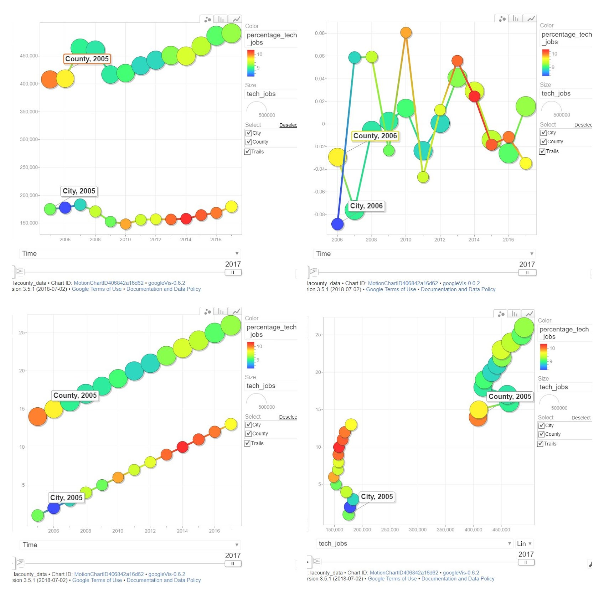
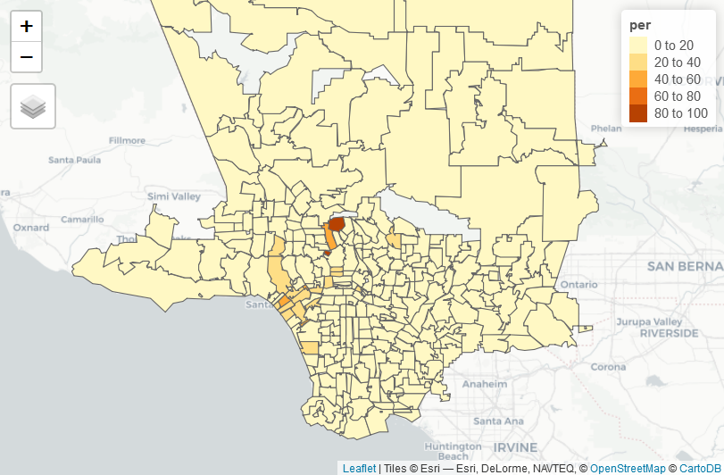
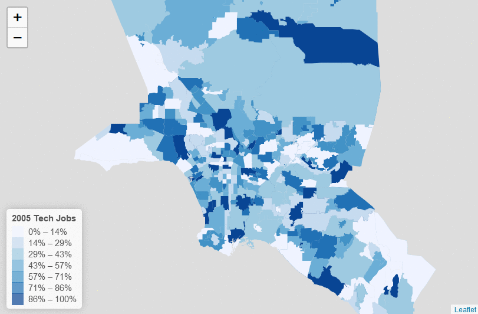

```{r setup, include=FALSE, echo=FALSE}
knitr::opts_chunk$set(echo=TRUE, error=FALSE)
  # Bureau Labor Statistics
  # install.packages("tidyverse") 
  # install.packages("scales")
  # install.packages("stringr")
  # install.packages("Hmisc") 
  # install.packages("forcats") 
  # install.packages("ggthemes")
  library("tidyverse") # contains many packages that allow you to organize, summarize, and plot data.
  library("scales") # use to customize the scales of our axes.
  library("stringr") # allows for manipulating of string and labels.
  library("Hmisc") # provides mathematical and statistical functions to use with plots.
  library("forcats") # provides tools for manipulating categorical variables.
  library("ggthemes") # provides multiple themes & parameters to change a plots look and feel
  library("readxl")
  # Correlation
  # library(readxl)
  # library(tidyverse)
  library(tidycensus) # downloads Census cartographic boundary shapefiles 
      # Before running code like the following from tidycensus,
      # you need to obtain an API key from the Census and then 
      # use the function census_api_key() to set it in R.
      # Request API: https://api.census.gov/data/key_signup.html
      # Once you have your key intall using the following:
      # census_api_key("777_your_key_777abc", install = TRUE) 
      # First time, reload your environment so you can use the key without restarting R.
      # readRenviron("~/.Renviron")
      # If you do not have an .Renviron file, the function will create on for you. If you already have
      # an .Renviron file, the function will append the key to your existing file, while making a backup
      # of your original file for disaster recovery purposes.
      # You can check your key with:
      # Sys.getenv("CENSUS_API_KEY")
      
# Load Zip Code Payroll Data
      library(readxl)
      
# Gif Animation
      library(magick) # this is call to animate/read pngs
# Maps
      library(sf)             # ...................... reading, writing and wangling sf class for map
      library(tidyverse)      #....................... R packages for data
      library(htmltools)      #....................... converting some data object to HTML and js
      library(leaflet)        # .......................  interactive map
      library(rmapshaper)     # ........................ resizing the shapefile
      library(tidycensus)     # .......................... getting data from Censues
      library(tigris)         # .......................... getting the shape file from United States Census
      library("tmap")         # thematic visualization, with a focus on mapping the spatial data attributes
      library("tmaptools")
      library(readxl)
      library(dbplyr)
      library(data.table) # data.table as an advanced version of data.frame #Fread
      library(rgdal)
      # install tigris with sf support
      # devtools::install_github("walkerke/tigris")
      # https://walkerke.github.io/tigris-webinar/#3
      # install.packages("tmap")
      # install.packages("tmaptools")
      # webshot::install_phantomjs() #save static version of map
      # install.packages("shinycssloaders")
      # install.packages("shinythemes")
      # install.packages("tidycensus")
      # install.packages("rmapshaper")
```

```{r Load Zip Code Payroll Data, include=FALSE, echo=FALSE}
laz2017 <- data.frame(read_excel("./data/la_zip_payroll.xlsx", sheet="2017"))
# Repalceing NA with the value of 100 because I want to use it to subset/filter the industry
laz2017[is.na(laz2017)]=100
# Remove "Total" in Zip.Code
laz2017$Zip.Code=gsub("Total","",laz2017$Zip.Code)
# Replace "*****" with 0
laz2017[laz2017=="*****"]=0
# Convert Column 5 and 6 from Character to Numeric
lapply(laz2017, class)
laz2017[,c(1,5:6)]=sapply(laz2017[c(1,5:6)], as.numeric)
#  Subset Tech
# Subset for the total sector job
laz17et=subset(laz2017,NAICS==100)
# Subset for the Information sector jobs
laz17ei=subset(laz2017,NAICS==51)
# Subset for the Professional Scientific Technical Services sector job in South Bay
laz17ebp=subset(laz2017,NAICS==54)
laz17tech.a=merge(laz17et[,c(1,5)], laz17ei[,c(1,5)], by="Zip.Code", all=TRUE)
laz17tech=merge(laz17tech.a, laz17ebp[,c(1,5)], by="Zip.Code", all=TRUE)
laz17tech$year = c(2017)
laz17tech[is.na(laz17tech)] <- 0
colnames(laz17tech) = c("zip", "total", "info", "prof", "year")
laz17tech$tech = (laz17tech$info + laz17tech$prof)
laz17tech$per = round(((laz17tech$tech / laz17tech$total)*100), 2)
lacounty17 <- laz17tech
lacounty17 <- lacounty17[c(1,5,6,3,4,7,2)]
head(lacounty17)
laz2017 <- data.frame(read_excel("./data/la_zip_payroll.xlsx", sheet="2016"))
# Repalceing NA with the value of 100 because I want to use it to subset/filter the industry
laz2017[is.na(laz2017)]=100
# Remove "Total" in Zip.Code
laz2017$Zip.Code=gsub("Total","",laz2017$Zip.Code)
# Replace "*****" with 0
laz2017[laz2017=="*****"]=0
# Convert Column 5 and 6 from Character to Numeric
lapply(laz2017, class)
laz2017[,c(1,5:6)]=sapply(laz2017[c(1,5:6)], as.numeric)
# Subset for the total sector job
laz17et=subset(laz2017,NAICS==100)
# Subset for the Information sector job
laz17ei=subset(laz2017,NAICS==51)
# Subset for the Professional Scientific Technical Services sector job in South Bay
laz17ebp=subset(laz2017,NAICS==54)
laz17tech.a=merge(laz17et[,c(1,5)], laz17ei[,c(1,5)], by="Zip.Code", all=TRUE)
laz17tech=merge(laz17tech.a, laz17ebp[,c(1,5)], by="Zip.Code", all=TRUE)
laz17tech$year = c(2016)
laz17tech[is.na(laz17tech)] <- 0
colnames(laz17tech) = c("zip", "total", "info", "prof", "year")
laz17tech$tech = (laz17tech$info + laz17tech$prof)
laz17tech$per = round(((laz17tech$tech / laz17tech$total)*100), 2)
lacounty16 <- laz17tech
lacounty16 <- lacounty16[c(1,5,6,3,4,7,2)]
head(lacounty16)
laz2017 <- data.frame(read_excel("./data/la_zip_payroll.xlsx", sheet="2015"))
# Repalceing NA with the value of 100 because I want to use it to subset/filter the industry
laz2017[is.na(laz2017)]=100
# Remove "Total" in Zip.Code
laz2017$Zip.Code=gsub("Total","",laz2017$Zip.Code)
# Replace "*****" with 0
laz2017[laz2017=="*****"]=0
# Convert Column 5 and 6 from Character to Numeric
lapply(laz2017, class)
laz2017[,c(1,5:6)]=sapply(laz2017[c(1,5:6)], as.numeric)
# Subset for the total sector job
laz17et=subset(laz2017,NAICS==100)
# Subset for the Information sector job
laz17ei=subset(laz2017,NAICS==51)
# Subset for the Professional Scientific Technical Services sector job in South Bay
laz17ebp=subset(laz2017,NAICS==54)
laz17tech.a=merge(laz17et[,c(1,5)], laz17ei[,c(1,5)], by="Zip.Code", all=TRUE)
laz17tech=merge(laz17tech.a, laz17ebp[,c(1,5)], by="Zip.Code", all=TRUE)
laz17tech$year = c(2015)
laz17tech[is.na(laz17tech)] <- 0
colnames(laz17tech) = c("zip", "total", "info", "prof", "year")
laz17tech$tech = (laz17tech$info + laz17tech$prof)
laz17tech$per = round(((laz17tech$tech / laz17tech$total)*100), 2)
lacounty15 <- laz17tech
lacounty15 <- lacounty15[c(1,5,6,3,4,7,2)]
head(lacounty15)
laz2017 <- data.frame(read_excel("./data/la_zip_payroll.xlsx", sheet="2014"))
# Repalceing NA with the value of 100 because I want to use it to subset/filter the industry
laz2017[is.na(laz2017)]=100
# Remove "Total" in Zip.Code
laz2017$Zip.Code=gsub("Total","",laz2017$Zip.Code)
# Replace "*****" with 0
laz2017[laz2017=="*****"]=0
# Convert Column 5 and 6 from Character to Numeric
lapply(laz2017, class)
laz2017[,c(1,5:6)]=sapply(laz2017[c(1,5:6)], as.numeric)
# Subset for the total sector job
laz17et=subset(laz2017,NAICS==100)
# Subset for the Information sector job
laz17ei=subset(laz2017,NAICS==51)
# Subset for the Professional Scientific Technical Services sector job in South Bay
laz17ebp=subset(laz2017,NAICS==54)
laz17tech.a=merge(laz17et[,c(1,5)], laz17ei[,c(1,5)], by="Zip.Code", all=TRUE)
laz17tech=merge(laz17tech.a, laz17ebp[,c(1,5)], by="Zip.Code", all=TRUE)
laz17tech$year = c(2014)
laz17tech[is.na(laz17tech)] <- 0
colnames(laz17tech) = c("zip", "total", "info", "prof", "year")
laz17tech$tech = (laz17tech$info + laz17tech$prof)
laz17tech$per = round(((laz17tech$tech / laz17tech$total)*100), 2)
lacounty14 <- laz17tech
lacounty14 <- lacounty14[c(1,5,6,3,4,7,2)]
head(lacounty14)
laz2017 <- data.frame(read_excel("./data/la_zip_payroll.xlsx", sheet="2013"))
# Repalceing NA with the value of 100 because I want to use it to subset/filter the industry
laz2017[is.na(laz2017)]=100
# Remove "Total" in Zip.Code
laz2017$Zip.Code=gsub("Total","",laz2017$Zip.Code)
# Replace "*****" with 0
laz2017[laz2017=="*****"]=0
# Convert Column 5 and 6 from Character to Numeric
lapply(laz2017, class)
laz2017[,c(1,5:6)]=sapply(laz2017[c(1,5:6)], as.numeric)
# Subset for the total sector job
laz17et=subset(laz2017,NAICS==100)
# Subset for the Information sector job
laz17ei=subset(laz2017,NAICS==51)
# Subset for the Professional Scientific Technical Services sector job in South Bay
laz17ebp=subset(laz2017,NAICS==54)
laz17tech.a=merge(laz17et[,c(1,5)], laz17ei[,c(1,5)], by="Zip.Code", all=TRUE)
laz17tech=merge(laz17tech.a, laz17ebp[,c(1,5)], by="Zip.Code", all=TRUE)
laz17tech$year = c(2013)
laz17tech[is.na(laz17tech)] <- 0
colnames(laz17tech) = c("zip", "total", "info", "prof", "year")
laz17tech$tech = (laz17tech$info + laz17tech$prof)
laz17tech$per = round(((laz17tech$tech / laz17tech$total)*100), 2)
lacounty13 <- laz17tech
lacounty13 <- lacounty13[c(1,5,6,3,4,7,2)]
head(lacounty13)
laz2017 <- data.frame(read_excel("./data/la_zip_payroll.xlsx", sheet="2012"))
# Repalceing NA with the value of 100 because I want to use it to subset/filter the industry
laz2017[is.na(laz2017)]=100
# Remove "Total" in Zip.Code
laz2017$Zip.Code=gsub("Total","",laz2017$Zip.Code)
# Replace "*****" with 0
laz2017[laz2017=="*****"]=0
# Convert Column 5 and 6 from Character to Numeric
lapply(laz2017, class)
laz2017[,c(1,5:6)]=sapply(laz2017[c(1,5:6)], as.numeric)
# Subset for the total sector job
laz17et=subset(laz2017,NAICS==100)
# Subset for the Information sector job
laz17ei=subset(laz2017,NAICS==51)
# Subset for the Professional Scientific Technical Services sector job in South Bay
laz17ebp=subset(laz2017,NAICS==54)
laz17tech.a=merge(laz17et[,c(1,5)], laz17ei[,c(1,5)], by="Zip.Code", all=TRUE)
laz17tech=merge(laz17tech.a, laz17ebp[,c(1,5)], by="Zip.Code", all=TRUE)
laz17tech$year = c(2012)
laz17tech[is.na(laz17tech)] <- 0
colnames(laz17tech) = c("zip", "total", "info", "prof", "year")
laz17tech$tech = (laz17tech$info + laz17tech$prof)
laz17tech$per = round(((laz17tech$tech / laz17tech$total)*100), 2)
lacounty12 <- laz17tech
lacounty12 <- lacounty12[c(1,5,6,3,4,7,2)]
head(lacounty12)
laz2017 <- data.frame(read_excel("./data/la_zip_payroll.xlsx", sheet="2011"))
# Repalceing NA with the value of 100 because I want to use it to subset/filter the industry
laz2017[is.na(laz2017)]=100
# Remove "Total" in Zip.Code
laz2017$Zip.Code=gsub("Total","",laz2017$Zip.Code)
# Replace "*****" with 0
laz2017[laz2017=="*****"]=0
# Convert Column 5 and 6 from Character to Numeric
lapply(laz2017, class)
laz2017[,c(1,5:6)]=sapply(laz2017[c(1,5:6)], as.numeric)
# Subset for the total sector job
laz17et=subset(laz2017,NAICS==100)
# Subset for the Information sector job
laz17ei=subset(laz2017,NAICS==51)
# Subset for the Professional Scientific Technical Services sector job in South Bay
laz17ebp=subset(laz2017,NAICS==54)
laz17tech.a=merge(laz17et[,c(1,5)], laz17ei[,c(1,5)], by="Zip.Code", all=TRUE)
laz17tech=merge(laz17tech.a, laz17ebp[,c(1,5)], by="Zip.Code", all=TRUE)
laz17tech$year = c(2011)
laz17tech[is.na(laz17tech)] <- 0
colnames(laz17tech) = c("zip", "total", "info", "prof", "year")
laz17tech$tech = (laz17tech$info + laz17tech$prof)
laz17tech$per = round(((laz17tech$tech / laz17tech$total)*100), 2)
lacounty11 <- laz17tech
lacounty11 <- lacounty11[c(1,5,6,3,4,7,2)]
head(lacounty11)
laz2017 <- data.frame(read_excel("./data/la_zip_payroll.xlsx", sheet="2010"))
# Repalceing NA with the value of 100 because I want to use it to subset/filter the industry
laz2017[is.na(laz2017)]=100
# Remove "Total" in Zip.Code
laz2017$Zip.Code=gsub("Total","",laz2017$Zip.Code)
# Replace "*****" with 0
laz2017[laz2017=="*****"]=0
# Convert Column 5 and 6 from Character to Numeric
lapply(laz2017, class)
laz2017[,c(1,5:6)]=sapply(laz2017[c(1,5:6)], as.numeric)
# Subset for the total sector job
laz17et=subset(laz2017,NAICS==100)
# Subset for the Information sector job
laz17ei=subset(laz2017,NAICS==51)
# Subset for the Professional Scientific Technical Services sector job in South Bay
laz17ebp=subset(laz2017,NAICS==54)
laz17tech.a=merge(laz17et[,c(1,5)], laz17ei[,c(1,5)], by="Zip.Code", all=TRUE)
laz17tech=merge(laz17tech.a, laz17ebp[,c(1,5)], by="Zip.Code", all=TRUE)
laz17tech$year = c(2010)
laz17tech[is.na(laz17tech)] <- 0
colnames(laz17tech) = c("zip", "total", "info", "prof", "year")
laz17tech$tech = (laz17tech$info + laz17tech$prof)
laz17tech$per = round(((laz17tech$tech / laz17tech$total)*100), 2)
lacounty10 <- laz17tech
lacounty10 <- lacounty10[c(1,5,6,3,4,7,2)]
head(lacounty10)
laz2017 <- data.frame(read_excel("./data/la_zip_payroll.xlsx", sheet="2009"))
# Repalceing NA with the value of 100 because I want to use it to subset/filter the industry
laz2017[is.na(laz2017)]=100
# Remove "Total" in Zip.Code
laz2017$Zip.Code=gsub("Total","",laz2017$Zip.Code)
# Replace "*****" with 0
laz2017[laz2017=="*****"]=0
# Convert Column 5 and 6 from Character to Numeric
lapply(laz2017, class)
laz2017[,c(1,5:6)]=sapply(laz2017[c(1,5:6)], as.numeric)
# Subset for the total sector job
laz17et=subset(laz2017,NAICS==100)
# Subset for the Information sector job
laz17ei=subset(laz2017,NAICS==51)
# Subset for the Professional Scientific Technical Services sector job in South Bay
laz17ebp=subset(laz2017,NAICS==54)
laz17tech.a=merge(laz17et[,c(1,5)], laz17ei[,c(1,5)], by="Zip.Code", all=TRUE)
laz17tech=merge(laz17tech.a, laz17ebp[,c(1,5)], by="Zip.Code", all=TRUE)
laz17tech$year = c(2009)
laz17tech[is.na(laz17tech)] <- 0
colnames(laz17tech) = c("zip", "total", "info", "prof", "year")
laz17tech$tech = (laz17tech$info + laz17tech$prof)
laz17tech$per = round(((laz17tech$tech / laz17tech$total)*100), 2)
lacounty09 <- laz17tech
lacounty09 <- lacounty09[c(1,5,6,3,4,7,2)]
head(lacounty09)
laz2017 <- data.frame(read_excel("./data/la_zip_payroll.xlsx", sheet="2008"))
# Repalceing NA with the value of 100 because I want to use it to subset/filter the industry
laz2017[is.na(laz2017)]=100
# Remove "Total" in Zip.Code
laz2017$Zip.Code=gsub("Total","",laz2017$Zip.Code)
# Replace "*****" with 0
laz2017[laz2017=="*****"]=0
# Convert Column 5 and 6 from Character to Numeric
lapply(laz2017, class)
laz2017[,c(1,5:6)]=sapply(laz2017[c(1,5:6)], as.numeric)
# Subset for the total sector job
laz17et=subset(laz2017,NAICS==100)
# Subset for the Information sector job
laz17ei=subset(laz2017,NAICS==51)
# Subset for the Professional Scientific Technical Services sector job in South Bay
laz17ebp=subset(laz2017,NAICS==54)
laz17tech.a=merge(laz17et[,c(1,5)], laz17ei[,c(1,5)], by="Zip.Code", all=TRUE)
laz17tech=merge(laz17tech.a, laz17ebp[,c(1,5)], by="Zip.Code", all=TRUE)
laz17tech$year = c(2008)
laz17tech[is.na(laz17tech)] <- 0
colnames(laz17tech) = c("zip", "total", "info", "prof", "year")
laz17tech$tech = (laz17tech$info + laz17tech$prof)
laz17tech$per = round(((laz17tech$tech / laz17tech$total)*100), 2)
lacounty08 <- laz17tech
lacounty08 <- lacounty08[c(1,5,6,3,4,7,2)]
head(lacounty08)
laz2017 <- data.frame(read_excel("./data/la_zip_payroll.xlsx", sheet="2007"))
# Repalceing NA with the value of 100 because I want to use it to subset/filter the industry
laz2017[is.na(laz2017)]=100
# Remove "Total" in Zip.Code
laz2017$Zip.Code=gsub("Total","",laz2017$Zip.Code)
# Replace "*****" with 0
laz2017[laz2017=="*****"]=0
# Convert Column 5 and 6 from Character to Numeric
lapply(laz2017, class)
laz2017[,c(1,5:6)]=sapply(laz2017[c(1,5:6)], as.numeric)
# Subset for the total sector job
laz17et=subset(laz2017,NAICS==100)
# Subset for the Information sector job
laz17ei=subset(laz2017,NAICS==51)
# Subset for the Professional Scientific Technical Services sector job in South Bay
laz17ebp=subset(laz2017,NAICS==54)
laz17tech.a=merge(laz17et[,c(1,5)], laz17ei[,c(1,5)], by="Zip.Code", all=TRUE)
laz17tech=merge(laz17tech.a, laz17ebp[,c(1,5)], by="Zip.Code", all=TRUE)
laz17tech$year = c(2007)
laz17tech[is.na(laz17tech)] <- 0
colnames(laz17tech) = c("zip", "total", "info", "prof", "year")
laz17tech$tech = (laz17tech$info + laz17tech$prof)
laz17tech$per = round(((laz17tech$tech / laz17tech$total)*100), 2)
lacounty07 <- laz17tech
lacounty07 <- lacounty07[c(1,5,6,3,4,7,2)]
head(lacounty07)
laz2017 <- data.frame(read_excel("./data/la_zip_payroll.xlsx", sheet="2006"))
# Repalceing NA with the value of 100 because I want to use it to subset/filter the industry
laz2017[is.na(laz2017)]=100
# Remove "Total" in Zip.Code
laz2017$Zip.Code=gsub("Total","",laz2017$Zip.Code)
# Replace "*****" with 0
laz2017[laz2017=="*****"]=0
# Convert Column 5 and 6 from Character to Numeric
lapply(laz2017, class)
laz2017[,c(1,5:6)]=sapply(laz2017[c(1,5:6)], as.numeric)
# Subset for the total sector job
laz17et=subset(laz2017,NAICS==100)
# Subset for the Information sector job
laz17ei=subset(laz2017,NAICS==51)
# Subset for the Professional Scientific Technical Services sector job in South Bay
laz17ebp=subset(laz2017,NAICS==54)
laz17tech.a=merge(laz17et[,c(1,5)], laz17ei[,c(1,5)], by="Zip.Code", all=TRUE)
laz17tech=merge(laz17tech.a, laz17ebp[,c(1,5)], by="Zip.Code", all=TRUE)
laz17tech$year = c(2006)
laz17tech[is.na(laz17tech)] <- 0
colnames(laz17tech) = c("zip", "total", "info", "prof", "year")
laz17tech$tech = (laz17tech$info + laz17tech$prof)
laz17tech$per = round(((laz17tech$tech / laz17tech$total)*100), 2)
lacounty06 <- laz17tech
lacounty06 <- lacounty06[c(1,5,6,3,4,7,2)]
head(lacounty06)
laz2017 <- data.frame(read_excel("./data/la_zip_payroll.xlsx", sheet="2005"))
# Repalceing NA with the value of 100 because I want to use it to subset/filter the industry
laz2017[is.na(laz2017)]=100
# Remove "Total" in Zip.Code
laz2017$Zip.Code=gsub("Total","",laz2017$Zip.Code)
# Replace "*****" with 0
laz2017[laz2017=="*****"]=0
# Convert Column 5 and 6 from Character to Numeric
lapply(laz2017, class)
laz2017[,c(1,5:6)]=sapply(laz2017[c(1,5:6)], as.numeric)
# Subset for the total sector job
laz17et=subset(laz2017,NAICS==100)
# Subset for the Information sector job
laz17ei=subset(laz2017,NAICS==51)
# Subset for the Professional Scientific Technical Services sector job in South Bay
laz17ebp=subset(laz2017,NAICS==54)
laz17tech.a=merge(laz17et[,c(1,5)], laz17ei[,c(1,5)], by="Zip.Code", all=TRUE)
laz17tech=merge(laz17tech.a, laz17ebp[,c(1,5)], by="Zip.Code", all=TRUE)
laz17tech$year = c(2005)
laz17tech[is.na(laz17tech)] <- 0
colnames(laz17tech) = c("zip", "total", "info", "prof", "year")
laz17tech$tech = (laz17tech$info + laz17tech$prof)
laz17tech$per = round(((laz17tech$tech / laz17tech$total)*100), 2)
lacounty05 <- laz17tech
lacounty05 <- lacounty05[c(1,5,6,3,4,7,2)]
head(lacounty15)
# Then, bind
lacountytech=rbind(lacounty05, lacounty06, lacounty07,
                   lacounty08, lacounty09, lacounty10,
                   lacounty11, lacounty12, lacounty13,
                   lacounty14, lacounty15, lacounty16, lacounty17)
colnames(lacountytech)[1] <- "GEOID"
colnames(lacountytech)
# no longer need these variables
rm(lacounty05)
rm(lacounty06)
rm(lacounty07)
rm(lacounty08)
rm(lacounty09)
rm(lacounty10)
rm(lacounty11)
rm(lacounty12)
rm(lacounty13)
rm(lacounty14)
rm(lacounty15)
rm(lacounty16)
rm(lacounty17)
rm(laz17ebp)
rm(laz17ei)
rm(laz17et)
rm(laz2017)
rm(laz17tech.a)
rm(laz17tech)
# Save as csv
# write.csv(lacountytech,"lacountytech.csv")
```


# City
<br>
<center></center><br>
<center><a href="https://www.flickr.com/photos/37527185@N05/13934368189/">PHOTO BY TYLER MERBLER</a>
<br>
Los Angeles, CA has a population of **3.98M** people with a median age of 35.6 and a median household income of $54,432. 
# County
<br>
<center></center><br>
<center><a href="https://www.flickr.com/photos/abukij/18012989253/">PHOTO BY PAOLO GAMBA</a> 
<br>
Los Angeles County, CA has a population of **10.1M people** with a median age of 36.3 and a median household income of $61,338. 
<br>
  The tech industry ..... doing well..... Many of the most valuable companies are tehc companies
<br>
Let's take a look at the tech industry employment [1] numbers for the past 13 years.
<br>

# Employment Projections

```{r Bureau Labor Statistics, include=FALSE, message=FALSE, echo=FALSE, warning=FALSE}

# Load data
occupation <- read_excel("./data/occupation.xlsx", sheet = "Table 1.1", skip = 2)
occupation <- occupation[1:23,] ### Removes Annotaions - keeps all data
colnames(occupation) <- c("industry","code", "2016", "2026", "change2026", "perchange206","median_wages17")

# Rename industries
occupation$industry <- c("Total All Occupations","Management","Business & Financial Operations",
                         "Computer & Mathematical","Architecture & Engineering",
                          "Life, Physical, & Social Science","Community & Social Service","Legal",
                         "Education, Training & Library","Arts & Recreation",
                          "Health Practitioners & Technicians","Healthcare Support","Protective Service",
                         "Food & Serving","Cleaning & Maintenance",
                          "Personal Care & Service","Sales","Administrative",
                         "Farming, Fishing, & Forestry","Construction & Extraction",
                          "Installation, Maintenance, & Repair","Production","Transportation & Material Moving")
                         
# Fix Labels
occupation$industry <- as.factor(occupation$industry)
levels(occupation$industry)

# Reordering Bars by Mean
levels(occupation$industry)

occupation$industry <- fct_reorder(occupation$industry, occupation$median_wages17, mean, na.rm=TRUE)

# The function takes four parameters: 
# (1) the factor variable to order levels,
# (2) the numerical variable to compute the mean (or other statistic) for each level
# (3) the summary statistic function we wish to use for ordering - we will pass along mean, but you can potentially
#     pass along another function like median or sum, and 
# (4) any parameters that you need to pass to the summary statistic function. In our case, we will pass the parameter,
#     na.rm=TRUE, so that the mean() function ignores missing values. The function returns a new factor variable whose 
#     levels are ordered appropriately, but it is otherwise equal to the original factor.
#     we call fct_reorder() and let the output overwrite our current industry variable in data frame df.

occupation$compu <- (occupation$industry == "Computer & Mathematical")
```

```{r Median Wages by Industry in 2017}
# add geom_hline showing "Total media wages"
# # Change the "horizontal justification" to be left-justified with hjust 

mycols <- c("blue", "red")
ggplot(data=occupation, mapping=aes(x=industry, y=median_wages17, fill=compu)) +
  stat_summary(fun.y=mean, geom="bar") +
  scale_y_continuous(labels=dollar) +
  labs(title="Median Wages by Industry in 2017", x="", y="") + 
  coord_flip() + 
  theme(legend.position="none") + 
  scale_fill_manual(values=mycols) + 
  geom_text(aes(label = median_wages17), color = "black", hjust=-0.1) +
  geom_hline(yintercept = 37690, color="red", size=1, linetype="dashed")
```

```{r Number of jobs change projected for 2026}
# remove all occupations

occupation <- occupation[2:23,]

occupation$industry <- fct_reorder(occupation$industry, occupation$change2026, mean, na.rm=TRUE)
ggplot(data=occupation, mapping=aes(x=industry, y=change2026, fill=compu)) +
  stat_summary(fun.y=mean, geom="bar") +
  scale_y_continuous() +
  labs(title="Employment Jobs Growth Projection by Industry 2016-2026 ", x="", y="") + 
  coord_flip() + 
  theme(legend.position="none") + 
  scale_fill_manual(values=mycols) + 
  geom_text(aes(label = change2026), color = "black", hjust=-0.1) 
  # geom_hline(yintercept = 37690, color="red", size=1, linetype="dashed")
```

```{r Percentage Growth Change 2026}
occupation$industry <- fct_reorder(occupation$industry, occupation$perchange206, mean, na.rm=TRUE)

ggplot(data=occupation, mapping=aes(x=industry, y=perchange206, fill=compu)) +
  stat_summary(fun.y=mean, geom="bar") +
  scale_y_continuous() +
  labs(title="% Employment Growth Projection by Industry 2016-2026 ", x="", y="") + 
  coord_flip() +
  theme(legend.position="none") +
  scale_fill_manual(values=mycols) +
  geom_text(aes(label = perchange206), color = "black", hjust=-0.1)
```

2017 Employment by major occupational group, 2016 and projected 2026 (Numbers in thousands) [1]. 
Tech employees are compensated nicely due to this tech boom. For example, in 207 while the annual medialn wage for all occupations was $37,000 in the U.S., it was $84,600 for the computer occupations, second only to $102,000 of the management occupations as shown in Table 1.
<br>


# Dinamic Visualizations

<br>
<center></center>
<center>Total jobs in the city of Los Angeles and County<center>

# Maps

<!-- <center></center><br> -->

```{r maptools , include=FALSE, message=FALSE, echo=FALSE, warning=FALSE}

# Load data
# lacounty_data  <- fread("./data/lacountytech.csv")

# Load list of all zip codes in LA county
masterzip <- data.frame(read_excel("./data/MasterZipCodes.xlsx")) 
names(masterzip) <- c("zipcode", "name")

# Download shape files for county from LA Data Portal
# https://data.lacounty.gov/Geospatial/ZIP-Codes/65v5-jw9f
zips.shp <- readOGR(("./data/zip-codes/geo_export_1887acad-adf8-4181-8c7d-50a16a3435f2.shp"))
head(zips.shp@data)

# Keep shape file with zip codes in county only
masterzip$zipcode <- as.factor(masterzip$zipcode)
zip.shp <- inner_join(zips.shp@data, masterzip, by = "zipcode")
cnty.zips <- as.data.frame(zips.shp$zipcode)
names(cnty.zips) <- c("GEOID")
lacounty_data$GEOID <- as.character(lacounty_data$GEOID) 
lacounty_data <- inner_join(cnty.zips, lacounty_data, by = "GEOID")

# Subset for 2017
df.17 <- lacounty_data %>% filter(year == 2017)
cnty.zips.17 <- cnty.zips

#line up between our data and the shapefile
is.element(cnty.zips.17$GEOID, df.17$GEOID)
# FALSE indicates zip code missing 

# add missing zip code
df.17 <- rbind(df.17, c(91023, 0, 2017,0,0,0,0,0))
df.17 <- df.17[order(df.17$GEOID),]

# All TRUE - both data frames are lined up
is.element(cnty.zips.17$GEOID, df.17$GEOID)

## joining data with geometry data to map the data
str(zips.shp@data)
head(zips.shp@data)
str(df.17)
zips.shp$zipcode <-as.numeric(zips.shp$zipcode)
names(zips.shp)
df.17$GEOID<-as.numeric(df.17$GEOID)

# Dot Density Maps using maptools
library(maptools)

# Map boundaries
cacounties.shp <- zips.shp
cacounties <- SpatialPolygonsDataFrame(cacounties.shp, data=as(cacounties.shp, "data.frame"))

```

```{r Dot Density Map}

# Set zero margins in plot window, so that map fits
par(mar=c(0,0,0,0))
# plot(zips.shp, lwd=0.1)

# One dot per 10 people
plotvar <- df.17$tech/10

# Calculated random dots for each zip code and store the coordinates in cadots.rand
cadots.rand <- dotsInPolys(zips.shp, as.integer(plotvar), f="random")

# Plot a specific region - zooms in LA conty
plot(zips.shp, lwd=0.1, xlim=c(-118.510000,-117.820000), ylim=c(33.710000,34.860000))
plot(cadots.rand, add=T, pch=19, cex=0.1, col="#000080", border="red") # Blue ---- "#09900d" Green

# rm(plotvar)
# rm(cadots.rand)
# rm(cacounties)
# rm(cacounties.shp)
# rm(mycols)
# rm(cnty.zips)
# rm(cnty.zips.17)

```
<center>**2017 Dot density map** for each zip code LA county.<center>
<center>Each dot = 10 tech jobs<center>
<br>

```{r gif animation}
# install imageMagick
# https://www.imagemagick.org/script/download.php#windows

# Tutorials
# https://ryanpeek.github.io/2016-10-19-animated-gif_maps_in_R/
# https://cran.r-project.org/web/packages/magick/vignettes/intro.html

# library(magick) # this is call to animate/read pngs

# save all png files to path folder

# create gif
# list.files(path = "C:/Users/joao_/Downloads/Gif/", pattern = "*.png", full.names = T) %>%
#   map(image_read) %>% # reads each path file
#   image_join() %>% # joins image
#   image_animate(fps=100) %>% # animates, can opt for number of loops
#   image_write("tech_100.gif") # write to current dir
```

```{r leaflet,  include=TRUE, message=FALSE, echo=FALSE, warning=FALSE}

# # 2017 Tech - 10 bins
# 
# qpal <- colorQuantile("Blues", df.17$tech  , n = 10)
# map_tech17 <- leaflet(zips.shp) %>%
#   setView(lng = -118.2437, lat = 34.2522, zoom = 10) %>%
#   addPolygons(stroke = FALSE,
#               smoothFactor = 0.2,
#               fillOpacity = 1,
#               color = ~qpal(df.17$tech)) %>%
#   leaflet::addLegend(pal = qpal, values = ~df.17$tech,
#                      title = "2017 Tech Jobs", opacity = 0.7, position = 'bottomleft')
# map_tech17

```


```{r new leaflet,  include=TRUE, message=FALSE, echo=FALSE, warning=FALSE}


# install.packages("leaflet.extras")
library(leaflet.extras)

# 2017 new

pal <- colorQuantile("Blues", NULL, n = 12)
popup <- paste0("<strong>Zip code: </strong>", 
                      df.17$GEOID, 
                      "<br><strong>% Tech Jobs: </strong>", 
                      df.17$per,
                      "<br><strong>Professional Jobs: </strong>", 
                      df.17$prof,
                      "<br><strong>Information Jobs: </strong>", 
                      df.17$info)


m <- leaflet(data = zips.shp) %>%
  addProviderTiles("CartoDB.Positron") %>%
  addResetMapButton() %>%
  addSearchOSM() %>%
  addSearchGoogle() %>%
  addSearchUSCensusBureau() %>% 
  addPolygons(fillColor = ~pal(df.17$per), 
              fillOpacity = 0.8, 
              color = "#BDBDC3", 
              weight = 1,
              popup = popup)
m

# List of map providers
# https://leaflet-extras.github.io/leaflet-providers/preview/

# providers$Esri.WorldStreetMap 
# m1 <- leaflet(data = zips.shp) %>%
#   addProviderTiles(providers$Esri.WorldStreetMap) %>%
#   addResetMapButton() %>%
#   addSearchOSM() %>%
#   addSearchGoogle() %>%
#   addSearchUSCensusBureau() %>% 
#   addPolygons(fillColor = ~pal(df.17$per), 
#               fillOpacity = 0.8, 
#               color = "#BDBDC3", 
#               weight = 1,
#               popup = popup)
# m1


```


<!-- <center></center><br> -->
<!-- <br> -->
<!-- Figure 2 shows the evolution of Tech Jobs by zip code from 2012 to 2017 -->
<!-- <br> -->


```{r tmap,  include=TRUE, message=FALSE, echo=FALSE, warning=FALSE}

# # Using zips shape file (LA County)
# map <- tm_shape(zips.shp) +
#   tm_polygons()
# tmap_mode('view')
# map <- tmap_leaflet(map)
# map %>% 
#   setView(lng = -118.2437, lat = 34.0522, zoom = 9) %>% 
#   addProviderTiles("CartoDB.Positron")

```

```{r shiny app,  include=TRUE, message=FALSE, echo=FALSE, warning=FALSE}

```

# Correlation Between the CHCI and the Median House Income of Los Angeles County Zip Codes
<br>
Fig. 8 shows the association between the 2012 CHCI and the 2016 median household income of 282 zip codes in L.A. County. We can see a **very strong correlation** correlation between the human capital level [23] and the household income for the zip code in L.A. It demonstrates the importance to invest in education (chci) in order to create more productive workforce and more high paying jobs.

```{r correlation, include=TRUE, message=FALSE, echo=FALSE, warning=FALSE}

# load data
chci <- data.frame(read_excel("./data/lacounty_zip_chci.xlsx", sheet="2012"))

# Getting data from the 2012-2016 5-year ACS
income <- get_acs(geography = "zcta", 
                  variables = c(medincome = "B19013_001"))

# In case API is not working
# write.csv(income, "data/income.csv")

cor <- merge(chci, income, by.x = "zip", by.y = "GEOID")

# Create the scatter plot with regression line

# p7 <- ggplot(cor, aes(x=chci, y=estimate)) +
#   geom_point(colour = "blue", size=4) + 
#   labs(title = "Fig. 8 ",
#        x = "City Human Capital Index", y = "Median Household Income ($)") +
#   scale_x_continuous(limits = c(85, 175)) +
#     geom_smooth(colour = "red", method=lm,   # Add linear regression line
#               se=FALSE)    # Don't add shaded confidence region
# p7

summary(cor)
#chci median 141

# NEW
p1 <- ggplot(cor, aes(x=chci, y=log(estimate)))+
  geom_point(colour = "red")
p1
p2 <- p1 +
  geom_smooth(mapping = aes(linetype = "r2"),
              method = "lm",
              formula = y ~ x , se = FALSE,
              color = "black")
p2 + geom_point()
p2 + geom_point(shape = 1, size = 2) # Changes to shape = 1
p3=p2 + geom_point(shape = 1, size = 3, stroke=1.5)
p3
# Labels overlap - use ggrepel
# install.packages("ggrepel") 
library("ggrepel") # Repel overlapping text labels away from each other.
p4 <- p3 + geom_text_repel(aes(label = zip), size=2) # Uses greppel text repel
p4

# Adds Title / Lables
p5 = p4+
scale_x_continuous(name = "Capital Human City Index")+
scale_y_continuous(name = "Log Income, 2016") +
ggtitle("CHCI and Median Income Per Zip Code")
p5

################


## Need to clean code bellow

str(df.17)
df.17$GEOID <- as.factor(df.17$GEOID)
names(masterzip) <- c("GEOID", "name")
z <- inner_join(df.17, masterzip, by = "GEOID")
str(z)
top_zip <- z %>% arrange(desc(per)) %>% top_n(20, wt=per)

names(top_zip) <- c("zip", "V1",    "year",  "tech",  "info",  "prof",  "per",   "total", "name")
str(cor)
str(top_zip)
top_zip$zip <- as.numeric(top_zip$zip)

cor <- inner_join(top_zip, cor, by="zip")
################
# Create the scatter plot with regression line

# p7 <- ggplot(cor, aes(x=chci, y=estimate)) +
#   geom_point(colour = "blue", size=4) + 
#   labs(title = "Fig. 8 ",
#        x = "City Human Capital Index", y = "Median Household Income ($)") +
#   scale_x_continuous(limits = c(85, 175)) +
#     geom_smooth(colour = "red", method=lm,   # Add linear regression line
#               se=FALSE)    # Don't add shaded confidence region
# p7

# NEW
p1 <- ggplot(cor, aes(x=chci, y=log(estimate)))+
  geom_point(colour = "red")
p1
p2 <- p1 +
  geom_smooth(mapping = aes(linetype = "r2"),
              method = "lm",
              formula = y ~ x , se = FALSE,
              color = "black")
p2 + geom_point()
p2 + geom_point(shape = 1, size = 2) # Changes to shape = 1
p3=p2 + geom_point(shape = 1, size = 3, stroke=1.5)
p3
# Labels overlap - use ggrepel
# install.packages("ggrepel") 
library("ggrepel") # Repel overlapping text labels away from each other.
p4 <- p3 + geom_text_repel(aes(label = zip), size=2) # Uses greppel text repel
p4

# Adds Title / Lables
p5 = p4+
scale_x_continuous(name = "Capital Human City Index")+
scale_y_continuous(name = "Log Income, 2016") +
ggtitle("CHCI and Median Income Per Zip Code")
p5

summary(cor)
# chci media 163


################
# str(df.17)
# df.17$GEOID <- as.factor(df.17$GEOID)
# names(masterzip) <- c("GEOID", "name")
# z <- inner_join(df.17, masterzip, by = "GEOID")
# str(z)
# top_zip <- z %>% arrange(desc(per)) %>% top_n(30, wt=per)
# str(cor)
# str(top_zip)


# # Creates vector with list of top tech zip codes
# top_zip$GEOID -> zip.label
# 
# # Only shows labels from list created
# 
# library(ggplot2)
# library(readxl) 
# library(tidyverse) # Includes ggplot2
# library(dplyr)
# 
# p6 = p5 + geom_text(aes(label = zip),
#             color = "gray20", data = filter(cor, cor$zip %in% zip.label))
# p6
# 
# 
# p4 = p3 + geom_text(aes(label = Country),
#             color = "gray20", data = filter(cpigdp, Country %in% country.label))
```

Source - 5-year American Community Survey 2012-2016 Global Innovation Index 2018, World Bank Population Data 2016, Q11 - Current country of residence [19-21]

```{r print table, include=TRUE, message=FALSE, echo=FALSE, warning=FALSE}

 knitr::kable(head(cor))

```


# Conclusions

* Gender imbalance continues (Fig. 1)
* BRICS to outnumber Western countries by 2020 (Fig. 6)
* User prevalence moderatedly-correlated with innovation (Fig. 8)


# References


1. [1] **Assumptions** Tech industry employment was calculated using the following: (1) Information jobs (NAICS: 51), and (2) Professional, Scientific, & Technical Skills (NAICS: 54). Data source: Quarterly Census of Employment and Wages (QCEW) developed through a cooperative program between the states and the U.S. Bureau of Labor Statistics.-- These data are summarized by Industry Sector (2-digit NAICS).
2. [2] https://www.bls.gov/emp/tables/emp-by-major-occupational-group.htm

Shape Files - https://data.lacity.org/ Los Angeles Open Data
ACS
 

23. [23] http://www.anderson.ucla.edu/centers/ucla-anderson-forecast/projects-and-partnerships/city-human-capital-index


# Acknowledgements
- This project was largely inspired by conversations with Dr. William Yu, UCLA 
- Dynamic Visualizations were inspire by <a href="https://www.google.com/publicdata/directory">Google Public Data Explorer</a>.
- Fig. 3 and 5 was largely inspired by conversations with Ferran Pujol of McKinsey &Co. Chile. 
- Fig. 6 inspired by the charts of @ash316 [15]
- Fig. 1,2,3 inspired by the charts of @paultimothymooney [4]
- <a href="https://twitter.com/hadleywickham">Hadley Wickham</a>, for his development of <a href="https://en.wikipedia.org/wiki/Hadley_Wickham">ggplot2
</a> (Fig 7, 8), the open-source statistical analysis & data visualisation based on Leland Wilkinson's book Grammar of Graphics. 

https://flowingdata.com/

https://geocompr.robinlovelace.net/index.html


<a href="https://www.theverge.com/2018/11/2/18057716/google-walkout-20-thousand-employees-ceo-sundar-pichai-meeting">#googleWalkout</a> [2] and is bad business - says Forbes [3]. In Fig. 1 (above), we use superhero-themes #batman #wonderwoman to visualize the heavy topic of #gender_equality in #datascience. See a bar chart for a more accurate breakdown [4]. Source: survey question Q1 - What is your gender? Sample size =  23,859 respondents 


2. [2] https://www.theverge.com/2018/11/2/18057716/google-walkout-20-thousand-employees-ceo-sundar-pichai-meeting
3. [3] https://www.forbes.com/sites/womensmedia/2017/08/03/breaking-down-the-gender-gap-in-data-science/#129d1bb74287
4. [4] https://www.kaggle.com/paultimothymooney/2018-kaggle-machine-learning-data-science-survey
5. [5] https://en.wikipedia.org/wiki/Generations_in_the_workforce
6. [6] Sinton, E (2011). 'Baby boomers are very privileged human beings' https://www.telegraph.co.uk/finance/personalfinance/pensions/8840963/Baby-boomers-are-very-privileged-human-beings.html retrieved October 23, 2013 from www.telegraph.co.uk
7. [7] Ken Blanchard Companies. (2009). Next Generation of workers. http://www.kenblanchard.com/img/pub/Blanchard_Next_Generation_of_Workers.pdf Retrieved October 14, 2013, from kenblanchard.com
8. [8] Adecco Group UK and Ireland. (n.d.). Managing the modern workforce. http://www.adeccogroupuk.co.uk/SiteCollectionDocuments/Adecco-Group-Workplace-Revolution.pdf Retrieved October 13, 2013, from www.Adeccouk.co.uk
9. ref. needed
10. [10] https://en.wikipedia.org/wiki/Affluence_in_the_United_States
11. [11] https://www.epi.org/blog/top-1-0-percent-reaches-highest-wages-ever-up-157-percent-since-1979/
12. [12] J. Berengueres, Sketch thinking. 2016
13. [13] https://en.wikipedia.org/wiki/Marimekko#Marimekko_chart
14. [14] ref. needed
15. [15] https://www.kaggle.com/ash316/kaggle-journey-2017-2018
16. [16] https://en.wikipedia.org/wiki/BRICS
17. [17] https://www.kaggle.com/harriken/brics-growth
18. [18] See primary vs. secondary color in https://material.io/design/color/the-color-system.html#color-theme-creation
19. [19] Dutta, S., Reynoso, R.E., Garanasvili, A., Saxena, K., Lanvin, B., Wunsch-Vincent, S., Le?n, L.R. and Guadagno, F., 2018. THE GLOBAL INNOVATION INDEX 2018: ENERGIZING THE WORLD WITH INNOVATION. GLOBAL INNOVATION INDEX 2018, p.1.
20. [20] CSV file global innovation in https://www.globalinnovationindex.org/analysis-indicator
21. [21] World Bank, https://data.worldbank.org/indicator/SP.POP.TOTL
22. [22] https://en.wikipedia.org/wiki/Kendall_rank_correlation_coefficient


<!-- # Leaflet for R -->
<!-- # https://rstudio.github.io/leaflet/ -->

<!-- # SF -->
<!-- # Tidy spatial data in R: using dplyr, tidyr, and ggplot2 with sf -->
<!-- # http://strimas.com/r/tidy-sf/ -->


 The shapefile format is a common way to store data for geographic areas, namely polygons, lines,
 and points. Each tract is represented as a polygon (i.e. some shape) 

Dowload shape files for county from LA Data Portal
https://data.lacounty.gov/Geospatial/ZIP-Codes/65v5-jw9f

```{r Tree Map, include=TRUE, message=FALSE, echo=FALSE, warning=FALSE}

# install.packages("portfolio")
# library(portfolio)
# 
# # install.packages("treemap")
# library(treemap)

# df.17$GEOID <- as.factor(df.17$GEOID)
# names(masterzip) <- c("GEOID", "name")
# z <- inner_join(df.17, masterzip, by = "GEOID")
# str(z)


# t <- z %>% arrange(desc(per)) %>% top_n(30, wt=per)
# 
# # make a tree map
# treemap(dtf = t,
#         index=c("name"),
#         vSize="per",
#         vColor="tech",
#         palette="Blues",
#         type="value",
#         border.col=c("grey70", "grey90"),
#         fontsize.title = 18,
#         algorithm="pivotSize",
#         title ="Treemap of the top 15 NZ's most populous cities",
#         title.legend="Population density (people/km^2)")


# y <- z[order(-z$per),]
# y <- z[1:20,]
# y$name <- c("Universal City","Glenoaks","Burbank 1","Playa Vista","Santa Monica","Burbank 2","Century City", "Cheviot Hills (City of LA)/Rancho Park", "Edwards AFB","Venice","Culver City","Hollywood","ARCO Towers (City of LA)","Mar Vista","Encino") 
# map.market(id=y$GEOID, area=y$per, group=y$name, color=y$per, main="Percentage")


# map.market(id=z$GEOID, area=z$per, group=z$name, color=z$per, main="Professional")

## Heat Map


# t <- z %>% arrange(desc(per)) %>% top_n(10, wt=per)
# row.names(t) <- t$GEOID
# 
# # leaders <- z[order(z$per),]
# # row.names(t) <- t$x
# # row.names(z) <- z$name
# t <- t[,5:9]
# # names(t) <- c("Information", "Professional", "Tech Density")
# # leaders <- leaders[,2:9]
# tech_matrix <- data.matrix(t)
# 
# 
# my_palette <- colorRampPalette(c("red", "yellow", "green"))(n = 299)
# heatmap(tech_matrix, Rowv=NA, Colv=NA, col = cm.colors(256), scale="column", margins=c(5,10))
# 
# heatmap(tech_matrix, Rowv=NA, Colv=NA, col = my_palette, scale="column", margins=c(5,10))
# 
# col_breaks = c(seq(-1,0,length=100),  # for red
#   seq(0.10,30,length=100),           # for yellow
#   seq(0.81,1,length=100))             # for green
# heatmap(tech_matrix, Rowv=NA, Colv=NA, col = my_palette, breaks=col_breaks, scale="column",dendrogram="row", margins=c(5,10))


```

